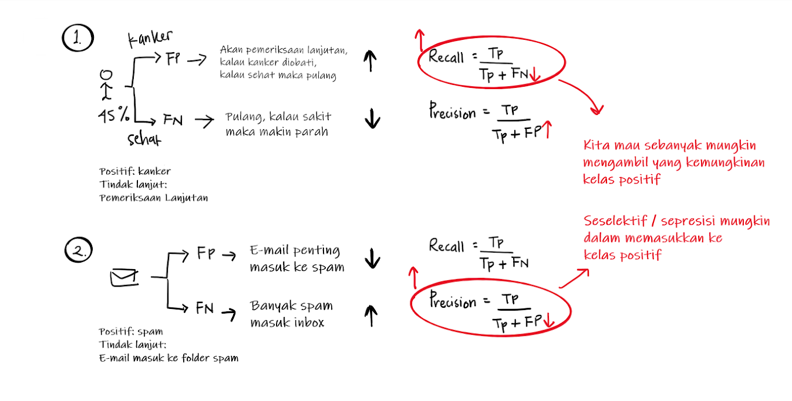

```{r setup, include=FALSE}
knitr::opts_chunk$set(echo = TRUE,
                      fig.align = "center")
options(scipen = 999)
```

```{r,echo=FALSE}

```

The following coursebook is produced by the team at Algoritma for BRI Data Hackathon 2021 Workshop: People Analytics. The coursebook is intended for a restricted audience only, i.e. the individuals having received this coursebook directly from the training organization. It may not be reproduced, distributed, translated or adapted in any form outside these individuals and organizations without permission.

Algoritma is a data science education center based in Jakarta. We organize workshops and training programs to help working professionals and students gain mastery in various data science sub-fields: data visualization, machine learning, data modeling, statistical inference, etc.


# Background {.tabset}
## Case Objective
People analytics, especially in Human Resource Management area, is revolutionising the way human resources departments operate, leading to higher efficiency and better results overall[^1]. Human resources has been using analytics for years. However, the collection, processing and analysis of data has been largely manual, and given the nature of human resources dynamics and HR KPIs, the approach has been constraining HR. Therefore, it is surprising that HR departments woke up to the utility of machine learning so late in the game. In this opportunity, we're going to do predictive analytics and also intepreting its ML model.

The data is taken from [Kaggle](https://www.kaggle.com/davidepolizzi/hr-data-set-based-on-human-resources-data-set). It's a synthetic data inspired from [this data](https://www.kaggle.com/rhuebner/human-resources-data-set) which has often been used to perform people analytics for Human Resource Management students at the college. Note the data is from fictitious company but the variable and the cases are identical to those in real companies. 
We're going to identifying which employees are most likely will leave the company so the HR will have enough time to do precautionary measure. Our analysis will be their first signal, so the company needs your help in doing such analysis with accurate and interpretable methods.

## Training Objective
This workshop cover most of data science workflow to explore, predict, and interpreting classification cases in human resource area. We'll be focus on interpret the business application rather than the math algorithm for every model. 

- Tabular Data Preparation:
   - Data Importing
   - Data preprocessing/wrangling
   - EDA and data visualization
- ML modeling with tidymodel:
   - Easy modeling with tidymodel
   - try several classification algorithm
   - grid search for hyperparameter tuning
- Model Evaluation:
   - train test split
   - confusion matrix
   - Interpreting ML algorithm with LIME
   
   
## Library
Load this package in your R. If you don't have any, please run the chunk below

```{r,eval=FALSE}
packages <- c("tidyverse","lubridate","ggplot2","plotly","FactoMineR","factoextra",
              "tidytext","rsample","caret","tidymodels","ranger","lime")
install.packages(packages)
```


```{r,warning=FALSE,message=FALSE}
library(tidyverse) # Data Wrangling
library(lubridate) # Date type data
library(ggplot2) # Data Visualization
library(plotly) # Interactive data visualization
library(FactoMineR) # PCA
library(factoextra) # PCA Visualization
library(tidytext) # additional data wrangling
library(rsample) # data sampling
library(caret) # ML modeling
library(tidymodels) # ML modeling
library(ranger) # Random Forest
library(xgboost) # XGBoost
library(lime) # ML model intepretation
```

# Let's Begin
## Data Import
Our data stored in .txt format. R provides lots of method to import various kind of data format like csv, xlsx, or json. R also have packages that allows importing from various type of databases[^2]. In our case, the data in txt are separated by 'tab'. Sometimes is a good idea to look at your data by manually open it to see how it structured so we can import it easily. I use `read.table()` function to import the data (though its not the only function to import txt) with "tab" as custom separator, header TRUE to tells the function that the data already has column name and put NA to empty cells with fill parameter. 

```{r}
hrd <- read.table("data_input/HR DATA.txt",sep = "\t",header = T,fill = T)
head(hrd)
```
Here some data dictionary i collected from the original sources:    

- `Employee Name`: Employee’s full name     
- `EmpID` : Employee ID is unique to each employee    
- `MarriedID` : Is the person married (1 or 0 for yes or no)   
- `MaritalStatusID`: Marital status code that matches the text field MaritalDesc   
- `EmpStatusID` : Employment status code that matches text field EmploymentStatus    
- `DeptID` : Department ID code that matches the department the employee works in   
- `PerfScoreID` : Performance Score code that matches the employee’s most recent performance score   
- `FromDiversityJobFairID` : Was the employee sourced from the Diversity job fair? 1 or 0 for yes or no   
- `PayRate` : The person’s hourly pay rate. All salaries are converted to hourly pay rate   
- `Termd` : Has this employee been terminated - 1 or 0    
- `PositionID` : An integer indicating the person’s position   
- `Position` : The text name/title of the position the person has   
- `State` : The state that the person lives in   
- `Zip` : The zip code for the employee    
- `DOB` : Date of Birth for the employee   
- `Sex` : Sex - M or F   
- `MaritalDesc` : The marital status of the person (divorced, single, widowed, separated, etc)   
- `CitizenDesc` : Label for whether the person is a Citizen or Eligible NonCitizen   
- `HispanicLatino` : Yes or No field for whether the employee is Hispanic/Latino   
- `RaceDesc` : Description/text of the race the person identifies with   
- `DateofHire` : Date the person was hired   
- `DateofTermination` : Date the person was terminated, only populated if, in fact, Termd = 1   
- `TermReason` : A text reason / description for why the person was terminated    
- `EmploymentStatus` : A description/category of the person’s employment status. Anyone currently working full time = Active	   
- `Department` : Name of the department that the person works in   
- `ManagerName` : The name of the person’s immediate manager   
- `ManagerID` : A unique identifier for each manager.   
- `RecruitmentSource` : The name of the recruitment source where the employee was recruited from    
- `PerformanceScore` : Performance Score text/category (Fully Meets, Partially Meets, PIP, Exceeds)   
- `EngagementSurvey` : Results from the last engagement survey, managed by our external partner   
- `EmpSatisfaction` : A basic satisfaction score between 1 and 5, as reported on a recent employee satisfaction survey    
- `SpecialProjectsCount` : The number of special projects that the employee worked on during the last 6 months   
- `LastPerformanceReviewDate` : The most recent date of the person’s last performance review.   
- `DaysLateLast30` : The number of times that the employee was late to work during the last 30 days   
- `Original.DS` : Whether the observation is from original dataset or synthetic    

## Data Cleaning
The data is undoubtedly messy. It has redundant information, wrong data type, and posibbly the presence of missing value or outlier. The most common step in data wrangling is to change data type and remove redundant variables. For example, we have `Employee_Name` and `EmpID` which tell us a same information. I prefer to use `Employee_Name` to identify our rows. Thus we need to remove the `EmpID` column. But before that we need to make sure every value in `Employee_Name` in unique.

```{r}
hrd[duplicated(hrd$Employee_Name),]
```

```{r}
hrd %>% 
   filter(Employee_Name %in% hrd[duplicated(hrd$Employee_Name),"Employee_Name"])
```

From the chunk above we know that there's some duplicated employee name. Let's add "2" in the second duplicated name to make it unique

```{r}
hrd[duplicated(hrd$Employee_Name),]$Employee_Name <- paste(hrd[duplicated(hrd$Employee_Name),]$Employee_Name,"2",sep = "")

hrd[duplicated(hrd$Employee_Name),]
```

Now there's no duplicated name. We also know that there are redundant variables like `MarriedID` and `MaritalDesc` or `DeptID` and `Department`. For me is better to keep the description column so we need to remove the id one.

```{r}
hrd <- hrd %>% 
  select(-c(EmpID,Zip,MarriedID,EmpID,MaritalStatusID,GenderID,EmpStatusID,
            DeptID,PerfScoreID,ManagerID,Original.DS,PositionID,DaysLateLast30))

head(hrd)
```

Next, let's change the data type. notice that almost every character variable is actually factor and some numeric like `FromDiversityJobFairID` and `Termd` is also a factor. Date type like `DOB` and `DateofHire` is listed as character. We need to change it all

```{r}
hrd <- hrd %>% 
   mutate(DOB = dmy(DOB),
          DateofHire = dmy(DateofHire),
          DateofTermination = dmy(DateofTermination),
          LastPerformanceReview_Date = dmy(LastPerformanceReview_Date),
          FromDiversityJobFairID = as.factor(FromDiversityJobFairID),
          Termd = as.factor(Termd)) %>% 
   mutate_if(is.character, as.factor) %>% 
   mutate(Employee_Name = as.character(Employee_Name))

head(hrd)
```

Everything looks fine except `DOB`. That column shows employees' date of birth so its impossible that someone was born above 2021. `dmy()` function assume year "64" is 2064 instead 1964. Sadly there's no parameter or option to change it to our desire, we need to fix it in the hard way.

That's one of the challenge in data cleaning process Sometimes we need to make our hand dirty by using weird code or workaround. In our case, first, i will separate the date component (year, month, day) by its separator then add "19" to the year (example: 64 -> 1964) then recombined everything and return it as date type

```{r}
# DOB in our data has become Date type, we can't change it to character directly. 
# We need to re-read the data and take that column only

dob <- read.table("data_input/HR DATA.txt",sep = "\t",header = T,fill = T)
dob <- strsplit(dob$DOB,split = "-") 

dob <- data.frame(matrix(unlist(dob), nrow=length(dob), byrow=T)) %>% 
  setNames(c("day","month","year")) %>% 
  mutate(year_new = paste("19",year,sep = ""))

head(dob)
```

Combine the date component and return it to date type
```{r}
hrd <- hrd %>% 
   mutate(DOB = paste(dob$day,dob$month,dob$year_new,sep = "-"),
          DOB = dmy(DOB))

head(hrd)
```

The data type has changed into the correct format. next lets see if our data have missing value
```{r}
colSums(is.na(hrd))
```

There are lots of way to deal with missing value. we can either remove it or impute with some logical value about the data. That's why is important to 'know' the data first before we do some analysis. We know that our data is about employee resignation from the company. It is make sense if `DateofTermination` has lots of missing value because the folowing observation may still working in the company. `LastPerformanceReview_Date` column shows when the last time the employee performance was reviewed. Maybe some employee is never been reviewed. However we need to fill the NA. let's fill the NA in both column with the day of data was taken. Why? let's keep going, i promise it will make sense later.

```{r}
recent <- as.Date("2020-01-01")

hrd <- hrd %>%
   mutate(DateofTermination = replace_na(hrd$DateofTermination,recent),
          LastPerformanceReview_Date = replace_na(hrd$LastPerformanceReview_Date,recent))

head(hrd)
```

It's clean now, but we still have some missing value
```{r}
colSums(is.na(hrd))
```

After some examination, i found that employee who has missing value in `EngagementSurvey` is also missing in `EmpSatisfaction` or `SpecialProjectsCount` and vice versa. 

```{r}
hrd %>% 
   filter(is.na(EngagementSurvey))
```

In addition, there're only 78 rows from 3310 are missing. I think its safe for us to remove the corresponding row instead of fill random numbers and wasted our time.

```{r}
hrd_clean <- hrd %>% 
   filter(!is.na(EngagementSurvey))

colSums(is.na(hrd_clean))
```


Now our data is clean but maybe we need to do more cleaning or feature engineering in next step, the data cleaning process is not done yet. In my point of view, i think we can do some simple feature engineering that maybe will improve our prediction model. See, date type is often useless if we put it to our model. We can turn in into something more logical for example, from our data we can make new column that shows in what age the employee were recruited by taking the difference between `DOB` and `DateofHire`. We also can make how many day is passed from the last time employee was reviewd by subtracting recent date with `LastPerformanceReview_Date`. 

```{r}
hrd_clean <- hrd_clean %>% 
  mutate(age = as.numeric(round((DateofHire - DOB)/365)),
         DayAfterReview = as.numeric(round(recent - LastPerformanceReview_Date)),
         WorkingDay = ifelse(Termd == 0,
                             as.numeric(round(recent - DateofHire)),
                             as.numeric(round(DateofTermination - DateofHire))))
head(hrd_clean)
```

We can use the new column to sharpen our analysis. Remember when i say we fill NA in `LastPerformanceReview_Date` by recent date? If we substract the date to get `DayAfterReview`, now we have "0". Thus we can assume that employee with "0" value in `DayAfterReview` column was never been reviewed. Notice that i also make a difference when creating `WorkingDay` column. To calculate how many day the employee been working for the company, For those who still active, i substract the day they get hired with recent day and for those who reitre or resign, i substract by with `DateofTermination`. 

You may have an idea to do more feature engineering. Don't be afraid to do it, It may improve our analysis and prediction. Feel free to tell me if you have one!

## Exploratory Data Analysis
Exploratory Data Analysis (EDA) is an important step that often forgotten. It isn't wise to put all variables as predictor directly by just holding one statistics test, like correlation, as justification to determine that the variables is good for predicting[^3].We can do EDA to know more about our data and make the first hypothesis for our prediction objective. There are lot of things to do in EDA step, data visualization is one of the most important[^4]. FYI, there is even job specialized to do this step, namely: "Data Analyst" or "Business Intelligence". Because there's too many stuff we can do, i'll provide some interesting question and we will try to answer it by wrangling the data.

*Interesting question:*

- Is there any extreme data or outlier among all numeric variables?    
- Is there any correlation between who a person works for and their performance score?    
- Is there any inequality in the company based on its pay rate? are there some departments that are paid more?     

### Is there any extreme data or outlier among all numeric variables?
```{r,echo=FALSE}
knitr::include_graphics("img/boxplot.png")
```

We can easily find outlier by drawing boxplot. Outlier is an extreme data that, statistically, is more or less than 1.5 IQR. Lets draw boxplot for every numeric variables
```{r}
hrd_clean %>% 
   select_if(is.numeric) %>% 
   pivot_longer(cols = c(names(.))) %>% 
   ggplot(aes(y = value)) +
   geom_boxplot(aes(fill = name),show.legend = F) +
   scale_fill_brewer(palette = "RdGy") +
   facet_wrap(~name,scales = "free_y") +
   theme_minimal()
```
From the plot above we know that `age`, `DayAfterReview`,`SpecialProjectsCount` and `WorkingDay` have some outlier. We also can find that using biplot. Biplot help us visualize lots of numeric variables into two dimensions. Each axis are represented by PC. PC or Principal Componets is the summarization of every scaled numeric variables. Each variabels has different contribution to each PC. In short, PCA help us to reduce dimensionality by summarise numeric variables.

Let's create the PCA

```{r}
factor <- which(sapply(hrd_clean, is.factor))

pca <- PCA(hrd_clean %>% `rownames<-`(hrd_clean$Employee_Name),
           quali.sup = c(1,7,13,14,24,26,factor),scale.unit = T,graph = F)
summary(pca)
```

By only using 3 PC, we already covers 60% variance of actual data. Let's draw some biplot
```{r,fig.width=9}
options(ggrepel.max.overlaps = Inf) 
plot.PCA(pca,choix = "ind",invisible = "quali",select = "contrib10",habillage = 4)
```

Even tough its kinda messy, we found 10 employee name that are considered as outliers. But remember this plot only represent approximately 44% variance of the actual data. In which variabel those employee are considered as outlier? let's see how the variables contribute to each PC

```{r}
plot.PCA(pca,choix = "var")
```

PC 1 or Dimension 1 is mostly contributed by `PayRate` and `SpecialProjectsCount`. Dim 2 is contributed by the other. From both plot, if the observation is placed to the most right, they have high `PayRate` and `SpecialProjectsCount`. If they placed to the most bottom, they have high `EngagementSurvey` and `age` but low `EmpSatisfaction` and `WorkingDay`. The 10 outliers is *maybe* has high value in `SpecialProjectsCount`, `age,` and `WorkingDay`. This statement is just the same as what we found using boxplot in previous result.

```{r,message=FALSE,warning=FALSE}
fviz_pca_biplot(pca,habillage = 4,invisible = "quali",label = "var",)
```

There are lots of information we can take from the biplot above. But take it with a grain of salt because its only summarize numeric value and only covered 44% of variance. Here some insight we can take:

- PC1 is highly contributed by `PayRate` and `SpecialProjectsCount.` PC2 by `EmpSatisfaction`, `WorkingDay`, `age`, and `EngagementSurvey`     
- `PayRate` and `SpecialProjectsCount` has high positive correlation    
- `EngagementSurvey` and `EmpSatisfaction` has high negative correlation    
- There is only slight different of contribution between `PayRate` and `SpecialProjectsCount` to PC1  
- `age` and `EmpSatisfaction` has more contribution to PC2 than `WorkingDay` and `EngagementSurvey`   
- Low `PayRate` and `SpecialProjectsCount` may affect the employee attrition    


### Is there any correlation between who a person works for and their performance score?  

Employee' manager and their performance score are portrayed in `ManagerName` and `PerformanceScore` column. We can't calculate correlation from categorical data but we can know if the data is dependent to each other by use statistical test named chi-square test of independence. This can be done using `chisq.test()` function.

```{r}
chisq.test(hrd_clean$ManagerName,hrd_clean$PerformanceScore)
```

To interpret the output, we first need to determine the null and alternative hypothesis

H0 = there is no relationship between Manager and employee performance score   
H1 = There is a relationship bertween manager and employee performance score   

From the output we know that p-value is less than the alpha (we use the most common alpha, 0.95), thus we need to reject the null hypthesis (H0) and we conclude that **There is a significant relationship bertween manager and employee perfornamce score**. We know that both column is associated to each other. 

We already answer the question, should we stop here? No.
EDA is the space of data visualization in data science workflow. Draw your best visualization here to inform people interesting things about the data


```{r,fig.width=8.5,fig.height=8}
# i found out there are empty factor level in some columns. we need to remove that level
hrd_clean <- hrd_clean %>% 
   droplevels()

table(hrd_clean$ManagerName,hrd_clean$PerformanceScore) %>% 
   as.data.frame() %>% 
   mutate(Var1 = reorder_within(Var1,by = Freq,within = Var2)) %>% 
   ggplot(aes(x = Freq, y = Var1)) +
   geom_col(aes(fill = Var2)) +
   scale_fill_brewer(palette = "RdGy") +
   facet_wrap(~Var2,scales = "free") +
   scale_y_reordered() +
   labs(title = "Employee Performance by Manager",
        subtitle = "Who have the Best Employee?",
        x = "Frequency", y = "Manager Name") +
   theme_minimal() +
   theme(legend.position = "none") 
```

The plot above show frequency of employee that have specific performance score by each manager. "Exceeds" is the best level performance and "PIP" is the lowest. We know that Brannon Miller is the best manager because he has the highest number of great employee, in contrast, John Smith is the worst. 

But is this plot enough to tell what is happening between employee and its manager relation to their performance score? I think its not. Maybe Brannon Miller has so many employee that if we calculate by frequency he looks as the best. 

```{r,message=FALSE,warning=FALSE}
# showing the number of rows per manager
hrd_clean %>% 
   group_by(ManagerName) %>% 
   count() %>% 
   arrange(-n)
```

Is now clear that Brannon Miller has lot of employee under its name compared to most manager. Let's wrangle the data to see the percentage of best employee by the total of employee from each manager.

```{r,message=FALSE,warning=FALSE}
manager_perf <- table(hrd_clean$ManagerName,hrd_clean$PerformanceScore) %>% 
  as.data.frame() %>% 
  pivot_wider(names_from = "Var2",values_from = "Freq") %>% 
  mutate(perc_exceed = round( Exceeds / (Exceeds + `Fully Meets` + `Needs Improvement` + PIP),3),
         perc_pip = round(PIP/ (Exceeds + `Fully Meets` + `Needs Improvement` + PIP),3))

manager_perf
```

The table above is the result of our aggregation. Now we have the information about each manager' employee performance and its percentage. Let's draw a plot about it

```{r}
manager_perf %>% 
   select(c(Var1,Exceeds,perc_exceed)) %>% 
   pivot_longer(cols = c(Exceeds,perc_exceed)) %>% 
   ggplot(aes(x = value, y = reorder(Var1,value))) +
   geom_col(aes(fill = name),show.legend = F) +
   scale_fill_manual(values = c("#bf0808","#3b3b3b")) +
   facet_wrap(~name,scales = "free_x") +
   labs(title = "Best Employee Performance by Manager",
        subtitle = "Frequency and Percentage",
        x = "Value", y = "Manager Name") +
   theme_minimal()
```

Now is true that Brannon Miller is the best Manager because not only by frequency of high performanced employee, but also by percentage. More than 30% of his employee has high performance. But we also know that Amy Dunn, the second best, is not actually the second best. Alex Sweetwater is better than her by percentage of their employee. With this type of information we can draw a correct conclussion because the calculation is balanced. Is important to share information that is the most true, rather than we 'want'.

```{r}
manager_perf %>% 
   select(c(Var1,PIP,perc_pip)) %>% 
   pivot_longer(cols = c(PIP,perc_pip)) %>% 
   ggplot(aes(x = value, y = reorder(Var1,value))) +
   geom_col(aes(fill = name),show.legend = F) +
   scale_fill_manual(values = c("#bf0808","#3b3b3b")) +
   facet_wrap(~name,scales = "free_x") +
   labs(title = "Worst Employee Performance by Manager",
        subtitle = "Frequency and Percentage",
        x = "Value", y = "Manager Name") +
   theme_minimal()
```

Well its true that John Smith has the lowest performance employee, both by frequency or percentage. Kissy sulivan however is the second best in both good and bad performance employee. Based on this founding the HR team can develop some action to improve the employe performance but also considering the manager influence.


### Is there any inequality in the company based on its pay rate? are there some departments that are paid more? 
```{r,message=FALSE,warning=FALSE}
hrd_clean %>% 
  group_by(Department) %>% 
  summarise(avg_PayRate = mean(PayRate),
            median_PayRate = median(PayRate),
            min_PayRate = min(PayRate),
            max_PayRate = max(PayRate)) %>% 
   arrange(-median_PayRate)
```

From the aggregation result we know `Production` department has the lowest average and median compated to other department, the median is not even a half of 4 highest payrate median. We know every department have different workload and there are always other factors that affect the salary. So we can't directly say that there is an equality in `payRate` in different departments. We can get better insight if we analyze the `payRate` by each department

```{r}
hrd_clean %>% 
   filter(Termd == 0) %>% 
   select(PayRate,Department,WorkingDay) %>% 
   ggplot(aes(x = WorkingDay, y = PayRate)) +
   geom_point(aes(col = WorkingDay),show.legend = F) +
   scale_color_continuous(low = "#3b3b3b",high = "#bf0808") +
   facet_wrap(~Department) +
   labs(title = "PayRate and WorkingDay Correlation",
        subtitle = "by each department") +
   theme_minimal()

```

Its a common knowledge that the longer employee work in same company, the higher the salary. But from the plot above, for every department, there is no correlation between `WorkingDay` and `PayRate`. 

```{r,warning=FALSE,message=FALSE}
GGally::ggcorr(hrd_clean %>% 
                 select_if(is.numeric),label = T,legend.position = "none")
```

Relationship from every numeric variable are also has very low correlation with `PayRate` except `SpecialProjectsCount`. Correlation betweet `SpecialProjectsCount` and `payRate` is 0.5 means if the `SpecialProjectsCount` get higher, the `payRate` is also get higher. We can say that there is no correlation between `payRate` and `Department` and the `payRate` maybe influenced by the number of `SpecialProjectsCount`. 

```{r}
cor.test(hrd_clean$PayRate,hrd_clean$SpecialProjectsCount)
```

The `cor.test()` function is a statistical method to not only calculate the correlation, but also determine if it the variabel is significanly correlated to each other. The p-value is below the alpha (0.05), same like chi-square test, we failed to reject the null hypothesis. Thus we know that the variable is significanly correlated to each other and worth to analyze further. Let's see which department has the most `SpecialProjectsCount`. 

```{r,message=FALSE,warning=FALSE}
hrd_clean %>% 
  group_by(Department) %>% 
  summarise(total = sum(SpecialProjectsCount),
            avg = mean(SpecialProjectsCount)) %>% 
   arrange(-avg)

```

IT/IS department has the most `SpecialProjectsCount`, every employee in that department has 5 `SpecialProjectsCount` in average. We can assume that people in IT/IS department is most likely get higher `payRate` **because** they receive more Special Projects. Sales, however, has low average of special projects but they have the highest of `payRate` median.


# Modeling
We've done a lot of EDA. Now it's time to build prediction model. In this part we will build some model with different algorithm like Decision Tree, Random Forest, and XGBoost and pick one of the best. Even though we will be using lots of algorithm, the code itself is not complicated. `Tidymodels` package will help us to build model with same workflow. We only need to change 1 or 2 function based on the model. 

Our data has a lot of variables, 27 in total. Not all variabels are important to use in modeling step. We can remove some by identifying which variables has low variance, or subjectively select the variables

```{r}
zero_var <- nearZeroVar(hrd_clean)
zero_var
```

`nearZeroVar()` function return column index that has low (or near to zero) variance. Low variance data is bad to our model because there is not much information the model can learn. Next we use the index to subset to our data

```{r}
hrd_mod <- hrd_clean[,-zero_var]
head(hrd_mod)
```
Actually, our data still has some redundant information. For example, `TermReason` describe why employees are resign, same as `EmploymentStatus`. We will remove that kind of variables and also date and id variables

```{r}
hrd_mod <- hrd_mod %>% 
   select(-c(Employee_Name,DOB,DateofHire,TermReason,EmploymentStatus,WorkingDay))

head(hrd_mod)
```

Before modeling is important to split the data into train and test data. The train data will be used for train the model and test data to evaluate our model. We also need to check if the target variable is balanced. 

## Splitting
```{r}
prop.table(table(hrd_mod$Termd))
```

The data is not balance. After we split the data, we need to balance it using downsample or upsample

```{r}
set.seed(123)
splitter <- initial_split(hrd_mod,prop = 0.8,strata = "Termd")
train <- training(splitter)
test <- testing(splitter)
```

```{r}
prop.table(table(train$Termd))
```

upsampling will duplicate the minority until the data is balanced, in contrast, downsampling will remove the majority. Since the data is not that extreme unbalanced, i'll use downsampling.
```{r}
train_down <- downSample(train %>% select(-Termd), train$Termd)
# downSample() function rename Termd into Class. 
# lets rename it again and check the class probability
train_down <- train_down %>% 
   rename("Termd" = "Class") %>% 
   droplevels()
prop.table(table(train_down$Termd))
```

Now the train data is balanced and we're ready to do modeling. Since most ouf our data is categorical, i'll focus on building tree based model. i also will use default parameter when building the model. Parameter tuning deserve its own part

## Decision Tree
```{r,message=FALSE,warning=FALSE}
library(partykit)
#mod_dt <- ctree(Termd ~., data = train_down)

# it will take times everytime we fit the data
# i save the trained model and we only need to load it
mod_dt <- readRDS("model/mod_dt.rds")

# predict to test data
pred_dt <- predict(mod_dt,test,type = "prob")
head(data.frame(pred_dt))
```

Notice that i set the output predict as probability rather than class. We can always change the threshold to decide which class the prediction results in. For now, we will use 0.5 as the common threshold standard

```{r}
pred_dt_class <- as.factor(ifelse(pred_dt[,1] > 0.5,0,1))
conf_dt <- confusionMatrix(pred_dt_class,test$Termd,positive = "0")
conf_dt
```

Confusion matrix show us a lot of stuff. In the most common way to decide if the model is good enough is to look at the accuracy. we have 68.5% accuracy, is it good enough? Is accuracy the only important metrics in classification? To understand this lets take a short break to learn about confusion matrix

### confusion matrix
Confusion matrix gives you the difference of classification results by the actual value. There are some metrics that can be calculated from confusion matrix with each of them has its own interpretation and can be used differently depending on the case[^5]
```{r,echo=FALSE}

```

If 1 is the positive value
Confusion matrix consist in 4 parts:
- True Positive (TP): When we predict 1, the actual value is 1
- True Negative (TN): When we predict 0, the actual value is 0
- False Postive (FP): When we predict 1, the actual value is 0
- False Negative (FN): When we predict 0, the actual value is 1

Recall and precision is most common metrics beside accuracy that take FP or FN into account. They consider the weight of FP or FN and have interesting intepretation depends on the case

```{r,echo=FALSE}

```

The image above show some example of the case. In our case, is important to know which employee is likely to resign as far as we can so the HR department can do some action to prevent that. The cost if employees are resign is higher than if we do some precautionary action. Thus, **it is okay if we do the action to employee who doesn't want to resign but predicted to resign rather than actually missed someone who will resign before we do the action**. In confusion matrix terms, it simply means we need to avoid high False Negative (when employees are predicted to not resign, but actually does). In summary, we want high Recall value

### Optional: `cmplot()` for classification threshold
One of Algoritma mentor have created a package to create confusion matrix graph for Optimizing Probability Thresholds. Install the package from github then run the `confmat_plot()` function
```{r,eval=FALSE}
devtools::install_github("ahmadhusain/cmplot")
```

```{r,message=FALSE,warning=FALSE}
cmplot::confmat_plot(prob = pred_dt[,1],
             ref = test$Termd,
             postarget = "0",
             negtarget = "1")
```


## Random Forest
Now we will focus on recall metrics. Our previous decision tree model has 85.4% recall (sensitivity). In the next model we want to look at higher recall. 

```{r}
# mod_rf <- rand_forest(mode = "classification") %>% 
#   set_engine("ranger") %>% 
#   fit(Termd ~., data = train_down)

mod_rf <- readRDS("model/mod_rf.rds")
```

```{r}
pred_rf <- predict(mod_rf,test,type = "prob")
pred_rf_class <- as.factor(ifelse(pred_rf$.pred_0 >0.5, 0,1))

conf_rf <- confusionMatrix(pred_rf_class,test$Termd,positive = "0")
conf_rf
```

Random Forest recall is better than decision tree. It have 85.4% recall and 87.2% accuracy. We can improve this later in model tuning part. For now lets try another algorithm

## Xgboost
```{r,warning=FALSE}
# mod_xgb <- boost_tree(mode = "classification") %>%
#   set_engine("xgboost") %>%
#   fit(Termd~., data = train_down)

mod_xgb <- readRDS("model/mod_xgb.rds")
```


```{r}
pred_xgb <- predict(mod_xgb,test,type = "prob")
pred_xgb_class <- as.factor(ifelse(pred_xgb$.pred_0 > 0.5, 0,1))
conf_xgb <- confusionMatrix(pred_xgb_class,test$Termd,positive = "0")
conf_xgb
```

Even tough XGboost is the evolution of Random Forest, apparently, the result is not better than random forest. XGBoost has 80% accuracy and 77.3% recall. 

lets draw a table and conclude our modeling result

```{r}
data.frame(accuracy = c(conf_dt$overall[1],conf_rf$overall[1],conf_xgb$overall[1]),
           recall = c(conf_dt$byClass[1],conf_rf$byClass[1],conf_xgb$byClass[1])) %>% 
   `rownames<-`(c("Decision Tree","Random Forest","XGBoost")) %>% 
   arrange(-recall)
```

# Model Tuning
The model evaluation is quite good already. But we can always maximize the result by doing hyperparameter tuning. In short, hyperparameter tuning is choosing a set of optimal hyperparameter for a learning algorithm. We will provide set of value to every model' parameter and fit the model. We will take parameter value from the best fitting model. Since Decision Tree result is way lower than Random Forest or XGBoost, we will not tune the model and focusing only to the best 2.

set k-fold cross validation
```{r,echo=FALSE}

```

```{r}
set.seed(123)
folds <- vfold_cv(train_down,5,strata = "Termd")
```

## Random Forest
we will tune the `mtry` and `trees` parameter using grid tuning. this process will take a lot of time because it will train all possible parameter combination and extract the best result. we will aim the highest recall and ROC as our best model.
```{r}
# trees and mtry grid combination 
rf.grid <- expand.grid(trees = seq(500,700,50), mtry = 4:8)

# model setup. random forest using ranger engine where the trees and mtry 
# will be changed by its grid
rf.setup <- rand_forest(trees = tune(), mtry = tune()) %>%
  set_engine("ranger",importance = "impurity") %>%
  set_mode("classification")

# formula workflow
rf.wf <- workflow() %>% 
  add_model(rf.setup) %>% 
  add_recipe(recipe(Termd ~.,data = train_down,skip = T))

# fit the data to model workflow
# rf.tune <- tune_grid(rf.wf,resamples = folds,grid = rf.grid,
#                      metrics = metric_set(accuracy,recall,roc_auc))
```


```{r,warning=FALSE,message=FALSE}
rf.tune <- readRDS("model/rf_tune.rds")
show_best(rf.tune,metric = "recall")
```

random forest with 8 mtry and 500 tree is the best model based on recall. we will use it as our main random forest model
```{r}
rf_best <- rf.wf %>% 
  finalize_workflow(select_best(rf.tune,"recall")) %>% 
  fit(train_down)

rf_pred_2 <- predict(rf_best,test,type = "prob")
rf_pred_class2 <- as.factor(ifelse(rf_pred_2$.pred_0 > 0.5,0,1))

conf_rf_2 <- confusionMatrix(rf_pred_class2,test$Termd)
conf_rf_2
```

Voila! now we have recal 89.6% recall and 91% accuracy, its better than default Random Forest model we make earlier. Previously, i said that confusion matrix is just a game of deciding treshold. If we want to lower FN, the FP will raise. There is another metrics that calculate the goodnes of model for every classification treshold, its called Receiver Operating Characteristic (ROC) and Area Under ROC Curve (AUC). 


```{r}
cbind(rf_pred_2,rf_pred_class2,test$Termd) %>% 
   setNames(c("prob_0","prob_1","pred_class","truth")) %>% 
   roc_curve(truth,prob_0) %>% 
   autoplot()
```

The plot above shows ROC. The ROC itself doesn't have any value, its just portayed the tradeoff between sensitivity and 1-specificity if we change the treshold. A good ROC give curves closer to the top-left corner. 

```{r,message=FALSE,warning=FALSE}
cbind(rf_pred_2,rf_pred_class2,test$Termd) %>% 
   setNames(c("prob_0","prob_1","pred_class","truth")) %>% 
   roc_auc(truth, prob_0)
```

We have 0.98 AUC, that's great! it means the ROC curve covers 98% area in the whole plot. The higher it is, the better. Next, lets do another model tuning for XGBoost

## XGBoost
```{r}
xg.grid <- expand.grid(trees = seq(500,700,50), mtry = 4:8, learn_rate = c(0.1,0.01,0.005))

xg.setup <- boost_tree(trees = tune(), mtry = tune(), learn_rate = tune()) %>%
  set_engine("xgboost") %>%
  set_mode("classification")

xg.wf <- workflow() %>% 
  add_formula(Termd ~ .) %>% 
  add_model(xg.setup)

# xg.tune <- tune_grid(xg.wf,resamples = folds, grid = xg.grid,
#                      metrics = metric_set(accuracy,recall,roc_auc))
```


```{r,message=FALSE,warning=FALSE}
xg.tune <- readRDS("model/xg_tune.rds")
show_best(xg.tune,metric = "recall")
```

The best XGBooost model is created with 8 mtry, 700 trees and 0.1 learn_rate. we will use it as our main XGBoost model

```{r,warning=FALSE}
xg_best <- xg.wf %>% 
  finalize_workflow(select_best(xg.tune,"recall")) %>% 
  fit(train_down)

xg_pred_2 <- predict(xg_best,test,type = "prob")
xg_pred_class2 <- as.factor(ifelse(xg_pred_2$.pred_0 > 0.5,0,1))

conf_xg_2 <- confusionMatrix(xg_pred_class2,test$Termd)
conf_xg_2
```

The recall is slightly better than previous XGboost model but still lower than tuned random forest. Let's draw the ROC and calculate AUC

```{r}
cbind(xg_pred_2,xg_pred_class2,test$Termd) %>% 
   setNames(c("prob_0","prob_1","pred_class","truth")) %>% 
   roc_curve(truth,prob_0) %>% 
   autoplot()
```

Random Forest ROC curve is slightly beter than this, the curve is closer to the top left.

```{r}
cbind(xg_pred_2,xg_pred_class2,test$Termd) %>% 
   setNames(c("prob_0","prob_1","pred_class","truth")) %>% 
   roc_auc(truth, prob_0)
```

We have 0.92 AUC. it is true that in our case, Random Forest perform better than XGBoost. The Data Science team can develop this model to be used by HR Department to do the prediction. 

Let's summarise all the evaluation result

```{r}
data.frame(accuracy = c(conf_dt$overall[1],conf_rf$overall[1],conf_xgb$overall[1],
                        conf_rf_2$overall[1],conf_xg_2$overall[1]),
           recall = c(conf_dt$byClass[1],conf_rf$byClass[1],conf_xgb$byClass[1],
                      conf_rf_2$byClass[1],conf_xg_2$byClass[1])) %>% 
   `rownames<-`(c("Decision Tree","Random Forest","XGBoost","RF Tuned","XGB Tuned")) %>% 
   arrange(-recall)

```

Now we have our desired, most accurate model to predict which employee is most likely to resign. But the downside of robust algorithm like Random Forest is the diffulcties of intepretation. Some models can be easily interpreted, such as the linear or logistic regression model and decision trees. This sometimes drive the data scientist to choose more interpretable model since they need to communicate it to their manager or higher rank, who perhaps are not familiar with machine learning. To solve this problem we need additional tools to intepret our black box model, we can use a method called Local Interpretable Model-Agnostic Explanations (LIME)

# LIME for Model Intepretation
Intuitively, you can check the importance of each variable from the model based on the impurity of each variables. Variable importance quantifies the global contribution of each input variable to the predictions of a machine learning model.
```{r,message=FALSE,warning=FALSE}
tidy(rf_best$fit$fit$fit$variable.importance) %>% 
   ggplot(aes(x = x, y = reorder(names,x))) +
   geom_col(aes(fill = x),show.legend = F) +
   scale_fill_continuous(low = "#3b3b3b",high = "#bf0808") +
   labs(title  = "Random Forest Variable Importance",
        x = "",y = "") +
   theme_minimal()
```

However, variable importance measures rarely give insight into the average direction that a variable affects a response function. They simply state the magnitude of a variable’s relationship with the response as compared to other variables used in the model. We can’t know specifically the influence of each factors for a single observation. That’s why we need LIME to help us understand individually what makes people resign.


**NOTE:** For learning purpose, i use non-recipe workflow when building and tuning the model. However this method is not compatible to LIME explanator. In the chunk below i recreate our model with same parameter setting as our best model. For those who want a clean way to modeling using `tidymodels`, please take a look at this [article](https://rpubs.com/David21/Tidymodels)

```{r}
best_setup <- rand_forest(trees = 500, mtry = 8) %>%
  set_engine("ranger",importance = "impurity") %>%
  set_mode("classification")
rf_bestx <- fit_xy(object = best_setup,x = train_down %>% select(-Termd),
                   y = train_down$Termd)
```


```{r}
set.seed(123)
explainer <- lime(x = train_down %>% select(-Termd),
                  model = rf_bestx)
```

```{r,fig.width=8,fig.height=9.6}
set.seed(123)
explanation <- explain(x = test %>% select(-Termd) %>% dplyr::slice(1:2),
                       labels = "0",
                       n_permutations = 500,
                       dist_fun = "manhattan",
                       explainer = explainer, 
                       kernel_width = 3,
                       n_features = 10)

plot_features(explanation,ncol = 1)
```

We will take 2 observation for the example. The plot above is showing how our every variable take effect in prediction process based on our model. The text label:0 shows what value of target  variable is being explained. The Probability shows the probability of the observation belong to the label "0" (not resign). The color of each bar represent whether the features support or contradict if the observations labeled as "0".

The intepretation is quite simple, in observation one (left plot) "Position = Area Sales Manager" has the biggest weight to support the attrition to be 0 (not resign). This mean that employee who has such a position is most likely to stay in the company. in contrast, SpecialProjectCouts <=2 contradict the likelihood to not resign. means the less an employee was tasked with SpecialProjectsCounts, they tend to leave the company.

The next element is Explanation Fit. These values indicate how good LIME explain the model. Here we see the Explanation Fit for first observation is 57%. But its only 36% for observation 2, which can be interpreted that LIME can only explain a little about our model. You may consider not to trust the LIME output since it only has low Explanation Fit.

There are lots of interpretation we can take from the LIME plot above. Remember we only take 2 predicition as example to try LIME interpretation If you want more insight among different type of employee, you can always add more observation to the explainer. We as a data science team now have a justification to defend our model output. Its also can give the HRD team some insight why employee tends leave or stay in the company.


# Reference

- [Tidymodels](https://www.tidymodels.org/find/parsnip/)
- [Hyperparameter Tuning](https://en.wikipedia.org/wiki/Hyperparameter_optimization)
- [Tidymodels flow](https://rpubs.com/David21/Tidymodels)
- [LIME for Model Interpretation](https://algotech.netlify.app/blog/interpreting-classification-model-with-lime/)
- [The evolution of XGBoost](https://towardsdatascience.com/https-medium-com-vishalmorde-xgboost-algorithm-long-she-may-rein-edd9f99be63d)
- [AI usage in HR](https://www.forbes.com/sites/tomdavenport/2019/02/10/ai-and-hr-a-match-made-in-many-companies/?sh=133aac823cd3)
- [Deloitte Survey: State of AI in the Enterprise](https://www2.deloitte.com/content/dam/insights/us/articles/4780_State-of-AI-in-the-enterprise/DI_State-of-AI-in-the-enterprise-2nd-ed.pdf)

Publication:

- [Github Repo](https://github.com/western11/People-Analytics)
- [Rpubs](https://rpubs.com/jojoecp/People_Analytics)


Annotations

[^1]: [AI in HR Area](https://hrexecutive.com/how-ai-tech-and-virtual-reality-can-help-boost-employee-experience/)    
[^2]: [DB Connections (1.5)](https://askalgo.netlify.app/)    
[^3]:Yanai, I., Lercher, M. A hypothesis is a liability. [Genome Biol 21, 231 (2020). ](https://doi.org/10.1186/s13059-020-02133-w)
[^4]: [Importance of dataviz](https://github.com/lockedata/datasauRus)
[^5]: [Confusion Matrix](https://medium.com/@ksnugroho/confusion-matrix-untuk-evaluasi-model-pada-unsupervised-machine-learning-bc4b1ae9ae3f)


